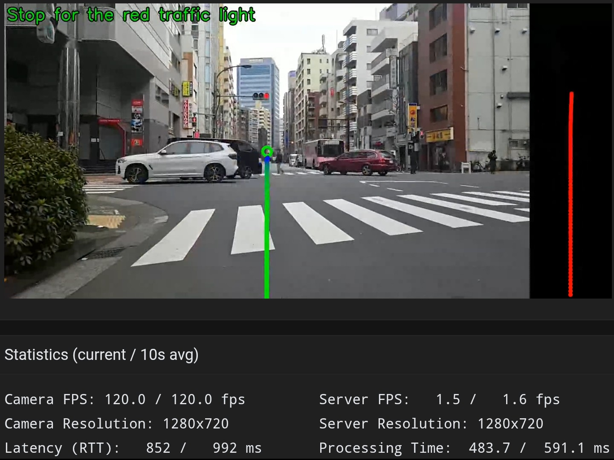
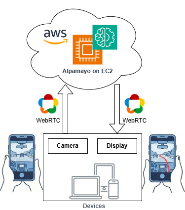
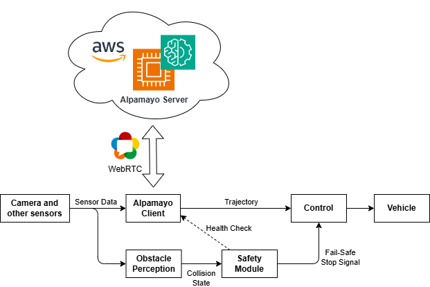

# Alpamayo WebRTC on AWS EC2

NVIDIA Alpamayo streaming demo for mobile devices, implemented with WebRTC on AWS EC2 (G7e instance).




https://youtu.be/uGFgMgqRNQ8


## Overview



## Features

- Real-time video streaming from client to server via WebRTC
- Image processing with multiple processor options:
  - **Alpamayo**: NVIDIA Alpamayo-R1 model for trajectory prediction with visualization
  - **Canny**: Canny edge detection using OpenCV
  - **Blur**: Gaussian blur using OpenCV
- Return processed video to client in real-time
- Send processing stats (image size, FPS, processing time, CoT) via DataChannel
- Mobile-friendly web client with sensor data support (GPS, accelerometer, gyroscope)

## Quick Start (AWS Deployment)

### 1. Deploy AWS Infrastructure

```bash
# Commands on a local PC

cd aws

# Region=ap-northeast-1
# AvailabilityZone=ap-northeast-1a
# ImageId=ami-0e7d0c8815f409923   # Deep Learning OSS Nvidia Driver AMI GPU PyTorch 2.9 (Ubuntu 24.04)
# InstanceType=g6.2xlarge
Region=us-east-2
AvailabilityZone=us-east-2a
ImageId=ami-0306ff3d44ab8cabd    # Deep Learning OSS Nvidia Driver AMI GPU PyTorch 2.9 (Ubuntu 24.04)
InstanceType=g7e.2xlarge

RootVolumeSize=128
SystemName=webrtc-alpamayo
TemplateFileName=./ec2_public_alb.yaml

aws cloudformation deploy \
  --region "${Region}" \
  --stack-name "${SystemName}" \
  --template-file ${TemplateFileName} \
  --capabilities CAPABILITY_NAMED_IAM \
  --parameter-overrides \
    SystemName="${SystemName}" \
    AvailabilityZone="${AvailabilityZone}" \
    ImageId="${ImageId}" \
    InstanceType="${InstanceType}" \
    RootVolumeSize="${RootVolumeSize}"
```

### 2. Setup on EC2

```bash
# Commands on AWS EC2
# export AWS_DEFAULT_REGION=us-east-2  or $env:AWS_DEFAULT_REGION = "us-east-2"
# ssh webrtc-ec2-server

# Install dependencies
sudo apt update
sudo apt install -y nvidia-cuda-toolkit python3-pip

# Install uv
curl -LsSf https://astral.sh/uv/install.sh | sh
export PATH="$HOME/.local/bin:$PATH"

# Clone and setup
git clone https://github.com/iwatake2222/webrtc_server_client.git
cd webrtc_server_client
git submodule update --init

# Install Python dependencies
cd server
uv venv
source .venv/bin/activate
cd alpamayo
uv sync --active
cd ..
uv pip install -e .

pip install huggingface_hub --break-system-packages
huggingface-cli login

# Optional: Run test demo
python3 src/demo_01_example_clip.py
```

### 3. Run Server

```bash
# Commands on AWS EC2

cd server
source .venv/bin/activate

# Generate SSL certificate
openssl req -x509 -newkey rsa:4096 -keyout key.pem -out cert.pem -days 365 -nodes -subj "/CN=localhost"

# Run server
python -m src.main --host 0.0.0.0 --port 8080 --cert cert.pem --key key.pem --processor alpamayo

# Optional
nvidia-smi -q -d SUPPORTED_CLOCKS
sudo nvidia-smi -ac 12481,2430
sudo nvidia-smi -pm 1
```

### 4. Access the Application

1. Open `https://ec2-xxx-xxx-xxx-xxx.ap-northeast-1.compute.amazonaws.com:8080/`
2. Accept the self-signed certificate warning (click "Advanced" -> "Proceed to site")
3. Click the **Connect** button

Note. Where to find the URL: EC2 -> Instances -> Public DNS


## Local Development

### Setup

#### Server

```bash
cd server
uv venv
uv sync
source .venv/bin/activate  # Windows: .venv\Scripts\activate
```

#### Client

```bash
cd client
npm install
```

### Run

#### HTTP (localhost only)

```bash
cd server
source .venv/bin/activate
python -m src.main --host 0.0.0.0 --port 8080                      # Canny (default)
python -m src.main --host 0.0.0.0 --port 8080 --processor blur     # Blur
python -m src.main --host 0.0.0.0 --port 8080 --processor alpamayo # Alpamayo
```

Open `http://localhost:8080` in browser.

#### HTTPS (required for remote access)

HTTPS is required for camera access (`navigator.mediaDevices`) from remote browsers.

```bash
cd server

# Generate self-signed certificate
openssl req -x509 -newkey rsa:4096 -keyout key.pem -out cert.pem -days 365 -nodes -subj "/CN=localhost"

# Run with HTTPS
source .venv/bin/activate
python -m src.main --host 0.0.0.0 --port 8080 --cert cert.pem --key key.pem --processor alpamayo
```

Open `https://<server-ip>:8080` and accept the certificate warning.

### Test

#### Server

```bash
cd server
source .venv/bin/activate
pytest -v
flake8 src/ tests/
pylint src/
mypy src/
```

#### Client

```bash
cd client
npm test
npm run lint
```

## Command Line Options

| Option | Default | Description |
|--------|---------|-------------|
| `--host` | `0.0.0.0` | Host address to bind |
| `--port` | `8080` | Port to listen on |
| `--processor` | `canny` | Image processor (`canny`, `blur`, `alpamayo`) |
| `--log-level` | `INFO` | Log level (`DEBUG`, `INFO`, `WARNING`, `ERROR`) |
| `--cert` | None | Path to SSL certificate file (enables HTTPS) |
| `--key` | None | Path to SSL private key file |

## API Endpoints

| URL | Description |
|-----|-------------|
| `/` | Client UI |
| `/ws` | WebSocket signaling |
| `/health` | Health check |

## AWS Settings

### How to use GPU instances

- AWS Console -> `Service Quotas` -> `AWS services` -> `Amazon Elastic Compute Cloud (Amazon EC2)` -> search for `Running On-Demand G and VT instances`
- Click `Request increase at account level`, then set 8 or more for `Increase quota value` and send the request
- Wait for approval from AWS (usually within 24 hours)
- Check which availability zones support your desired instance type:

```bash
aws ec2 describe-instance-type-offerings \
    --location-type availability-zone \
    --filters Name=instance-type,Values=g7e.2xlarge \
    --region us-east-2 \
    --query "InstanceTypeOfferings[].Location" \
    --output table
```


### SSH Configuration

Add to `~/.ssh/config`:

```bash
Host i-* mi-*
    ProxyCommand sh -c "aws ec2-instance-connect send-ssh-public-key --instance-id %h --instance-os-user %r --ssh-public-key 'file://~/.ssh/id_rsa.pub' && aws ssm start-session --target %h --document-name AWS-StartSSHSession --parameters 'portNumber=%p'"

# Optional: specific instance alias
Host webrtc-ec2-server
    HostName i-00000000000000000
    User ubuntu
    ProxyCommand sh -c "aws ec2-instance-connect send-ssh-public-key --instance-id %h --instance-os-user %r --ssh-public-key 'file://~/.ssh/id_rsa.pub' && aws ssm start-session --target %h --document-name AWS-StartSSHSession --parameters 'portNumber=%p'"
```

For Windows PowerShell, replace:
- `sh -c` -> `C:\Windows\System32\WindowsPowerShell\v1.0\powershell.exe`
- `&&` -> `;`

Connect via:

```bash
# For Linux
export AWS_DEFAULT_REGION=us-east-2
# For Windows
$env:AWS_DEFAULT_REGION = "us-east-2"

ssh ubuntu@i-00000000000000000
# or
ssh webrtc-ec2-server
```

## Future Work(?)

A Toy Edge-Server Collaborative End-to-End Autonomous Driving System.
This is just a thought experiment and not a production-ready system.



## Acknowledgments

This project uses [NVIDIA Alpamayo](https://github.com/NVlabs/alpamayo) for trajectory prediction.

## License

This project is licensed under Apache 2.0.
